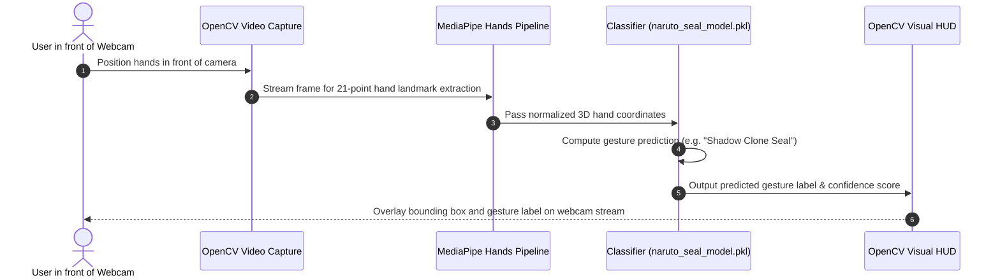

# Sign Detection — Hand Seal & Gesture Recognition Engine
[]()
[]()
[]()
[]()

## Overview
Sign Detection is an advanced computer vision and machine learning gesture recognition engine implemented in Python using OpenCV, MediaPipe, and Scikit-learn. The system performs real-time hand skeleton landmark extraction, temporal sequence tracking, and classification of complex hand signs (including cultural hand seals, ninja mudras, and gesture control commands).

- **Problem Solved:** Real-time multi-point hand pose tracking and classification from standard webcam video.
- **Target Users:** Computer vision researchers, HCI developers, and gaming enthusiasts.
- **Current Status:** Functional Computer Vision Engine.

## Features
- **21-Point Hand Skeleton Extraction:** Real-time 3D coordinate landmark tracking via MediaPipe.
- **Trained Machine Learning Model:** Pre-trained classifier (`models/naruto_seal_model.pkl`) for complex multi-hand seal recognition.
- **Live Dynamic Recognition:** Real-time webcam video classification with bounding box HUD overlays.
- **Dataset Collection Tool:** Interactive script (`dataset_collector.py`) for logging custom hand gesture training samples.

## Architecture


## User Flow


## Technology Stack
| Layer | Technology | Purpose |
|---|---|---|
| Core Language | Python 3.9+ | Application logic and vision pipeline |
| Computer Vision | OpenCV (cv2) | Frame capture, image processing, HUD rendering |
| Landmark Tracking | MediaPipe Hands | Real-time hand detection and 3D coordinate estimation |
| Machine Learning | Scikit-learn / NumPy / Pickle | Feature classification and model serialization |

## Infrastructure
- **Hardware Requirement:** Standard USB webcam or integrated laptop camera.
- **Processing Unit:** CPU or GPU accelerated MediaPipe inference.

## Project Structure
```text
Sign_detection/
├── models/
│   └── naruto_seal_model.pkl # Trained classifier serialized weights
├── src/
│   ├── dataset_collector.py       # Custom gesture data logging script
│   ├── hand_skeleton_test.py      # MediaPipe landmark verification test
│   ├── live_dynamic_recognition.py# Temporal gesture sequence classifier
│   └── live_recognition.py        # Real-time webcam classification loop
├── requirements.txt               # Python package dependencies
├── .gitignore                     # Git ignore definitions
└── README.md                      # Technical documentation
```

## Prerequisites
- Python 3.9 - 3.11
- Working webcam

## Environment Variables
*Not required. Camera index defaults to 0 (primary webcam).*

## Local Development Setup
1. Clone the repository:
   ```bash
   git clone https://github.com/Bhanutejanallamothu/Sign_detection.git
   cd Sign_detection
   ```
2. Create and activate a virtual environment:
   ```bash
   python -m venv venv
   source venv/bin/activate  # On Windows: venv\Scripts\activate
   ```
3. Install dependencies:
   ```bash
   pip install -r requirements.txt
   ```
4. Run live gesture recognition:
   ```bash
   python src/live_recognition.py
   ```
5. Press `q` to terminate the video window.

## Docker Setup
*Not recommended for local desktop execution due to webcam device passthrough constraints.*

## Database Setup
*Not applicable. Training data is stored in local CSV / Pickle formats.*

## API Documentation
Programmatic inference API:
```python
from src.live_recognition import classify_landmarks
result = classify_landmarks(normalized_hand_coordinates)
```

## Deployment
Packaged as an executable Python module for desktop or edge robotics devices (Raspberry Pi / NVIDIA Jetson).

## Security
- Safe unpickling verification of local model weights.
- Zero external network transmission of webcam video streams (runs completely offline).

## Testing
Verify landmark detection without model:
```bash
python src/hand_skeleton_test.py
```

## Troubleshooting
- **Camera Cannot Open:** Ensure no other application (Zoom, Teams) is using the webcam. In `cv2.VideoCapture(0)`, change `0` to `1` if you use an external camera.

## Future Improvements
- Two-hand interaction and mudra chaining with temporal LSTM networks.

## License
Computer vision research project. All rights reserved by repository owner.
